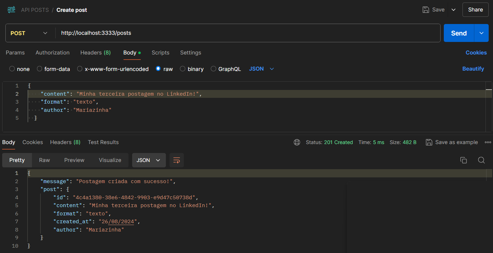
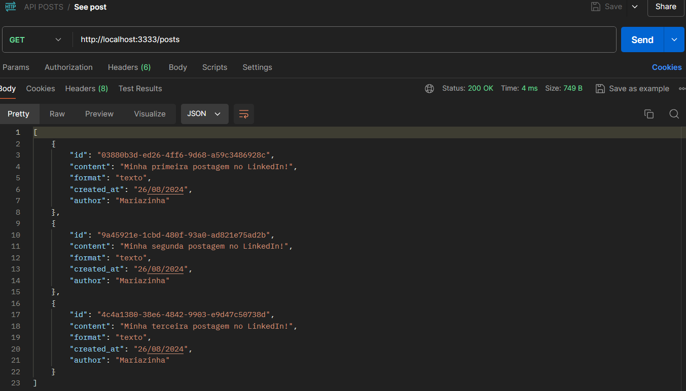
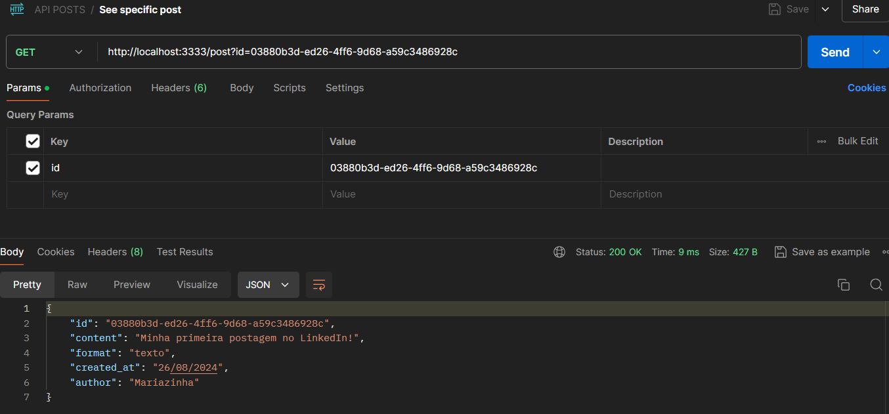
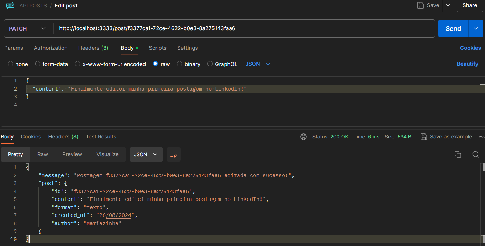
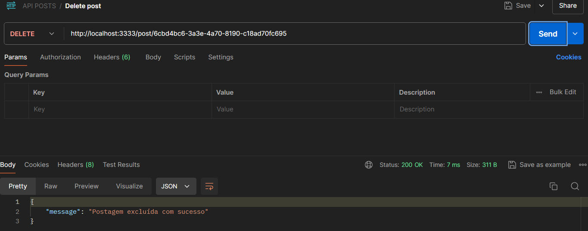

# API de Postagens LinkedIn

Esta é uma API simples para gerenciar postagens no estilo LinkedIn, permitindo: criar, listar, editar e excluir postagens todas as postagens e/ou uma postagem específica.

## 🛠️ Tecnologias Utilizadas

- **Node.js**
- **Express.js**
- **UUID**: Para gerar identificadores únicos para as postagens.
- **CORS**: Permitir requisições de diferentes origens.


## Instalação

1. Clone o repositório ou copie o código para seu ambiente local.
2. No diretório do projeto, instale as dependências executando o comando:

```bash
npm install
```

## 🚀 Como Executar

Após instalar as dependências, você pode iniciar o servidor com o seguinte comando:

```bash
npm start
```

O servidor será iniciado na porta `3333`, conforme configurado.

## Endpoints da API

### 1. Criar uma nova postagem

- **Método**: `POST`
- **Endpoint**: `/posts`
- **Descrição**: Cria uma nova postagem.
- **Corpo da Requisição (JSON)**:
  ```json
  {
    "content": "Minha primeira postagem no LinkedIn!",
    "format": "texto",
    "author": "Mariazinha"
  }
  ```
- **Resposta de Sucesso (201)**:
  ```json
  {
    "message": "Postagem criada com sucesso!",
    "post": {
      "id": "uuid-gerado",
      "content": "Minha primeira postagem no LinkedIn!",
      "format": "texto",
      "created_at": "26/08/2024",
      "author": "Mariazinha"
    }
  }
  ```

### 2. Listar todas as postagens

- **Método**: `GET`
- **Endpoint**: `/posts`
- **Descrição**: Retorna todas as postagens cadastradas.
- **Resposta de Sucesso (200)**:
  ```json
  [
    {
      "id": "uuid-gerado",
      "content": "Primeira postagem",
      "format": "texto",
      "created_at": "26/08/2024",
      "author": "Mariazinha"
    },
    {
      "id": "uuid-gerado",
      "content": "Segunda postagem",
      "format": "imagem",
      "created_at": "26/08/2024",
      "author": "Joãozinho"
    }
  ]
  ```

### 3. Listar uma postagem específica

- **Método**: `GET`
- **Endpoint**: `/post?id={id_da_postagem}`
- **Descrição**: Retorna uma postagem específica com base no ID.
- **Parâmetro (Query)**: `id` (UUID da postagem)
- **Resposta de Sucesso (200)**:
  ```json
  {
    "id": "uuid-gerado",
    "content": "Primeira postagem",
    "format": "texto",
    "created_at": "26/08/2024",
    "author": "Mariazinha"
  }
  ```

- **Resposta de Erro (404)**:
  ```json
  {
    "message": "Postagem não encontrada"
  }
  ```

### 4. Editar uma postagem específica

- **Método**: `PATCH`
- **Endpoint**: `/post/:id`
- **Descrição**: Edita uma postagem específica com base no ID.
- **Parâmetro (URL)**: `id` (UUID da postagem)
- **Corpo da Requisição (JSON)**:
  ```json
  {
    "content": "Conteúdo atualizado",
    "format":  "texto",
    "author":  "Joãozinho"
  }
  ```
- **Resposta de Sucesso (200)**:
  ```json
  {
    "message": "Postagem uuid-gerado editada com sucesso!",
    "post": {
      "id": "uuid-gerado",
      "content": "Conteúdo atualizado",
      "format": "texto",
      "created_at": "26/08/2024",
      "author": "Joãozinho"
    }
  }
  ```

- **Resposta de Erro (404)**:
  ```json
  {
    "message": "Postagem não encontrada"
  }
  ```

### 5. Excluir uma postagem específica

- **Método**: `DELETE`
- **Endpoint**: `/post/:id`
- **Descrição**: Exclui uma postagem com base no ID.
- **Parâmetro (URL)**: `id` (UUID da postagem)
- **Resposta de Sucesso (204)**: Nenhum conteúdo.
- **Resposta de Erro (404)**:
  ```json
  {
    "message": "Postagem não encontrada"
  }
  ```

## 📬 Exemplos de Teste no Postman

1. **Criar uma postagem**:  
   - Método: `POST`  
   - URL: `http://localhost:3333/posts`  
   - Body (JSON): 
   ```json
   {
     "content": "Minha primeira postagem!",
     "format": "texto",
     "author": "Autor Exemplo"
   }
   ```
   

2. **Listar todas as postagens**:  
   - Método: `GET`  
   - URL: `http://localhost:3333/posts`

   

3. **Listar uma postagem específica**:  
   - Método: `GET`  
   - URL: `http://localhost:3333/post?id=uuid-gerado`

    

4. **Editar uma postagem**:  
   - Método: `PATCH`  
   - URL: `http://localhost:3333/post/uuid-gerado`  
   - Body (JSON): 
   ```json
   {
     "content": "Conteúdo atualizado",
     "author": "Novo Autor"
   }
   ```
    

5. **Excluir uma postagem**:  
   - Método: `DELETE`  
   - URL: `http://localhost:3333/post/uuid-gerado`

    

## 💬 Entre em contato!

Gostou do projeto? Ficou com alguma dúvida? Entre em contato! 📧

---